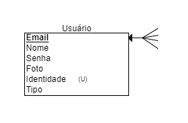

# Modelo de entidade-relacionamento

## Diagrama de entidade-relacionamento

## Diagrama de entedidade-relacionamento intermédiario

## Dicionário de dados

[Link Para o Arquivo da Planilha](Dicionário_de_Dados_Vumbora.xlsx)

## Modelo relacional

## Principais Tabelas Relacionais
### Tabela de Usuários
Na tabela contém as informações referentes ao usuário,como: nome, senha,foto, identidade (número de CPF ou CNPJ), e tipo de usuário (se é pessoa física ou jurídica).

### Tabela de Eventos
 Na tabela mostra as informações referentes a evento, como: nome, descrição, data e hora, valor e arte(Banner de divulgação). Os campos de ForeingKey se referem a: usuário que criou o evento(email-FK) e o local que o evento vai acontecer(CEP-FK/referência a tabela Local).

