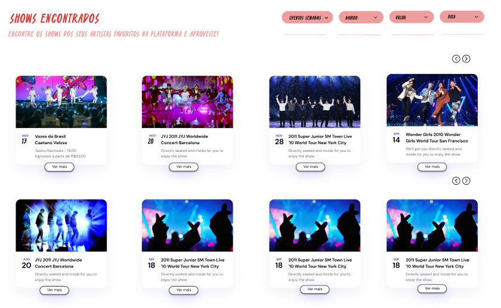

# CDU001. Listar Eventos

- **Ator principal**: Usuário, público geral, produtora
- **Atores secundários**: ...	 
- **Resumo**: O sistema deve listar os eventos marcados para acontecer na categoria de pesquisa escolhida pelo usuário. 
- **Pré-condição**: Sem pré-condição
- **Pós-Condição**: Eventos serão listados para visualização do usuário.

## Fluxo Principal
| Ações do ator | Ações do sistema |
| :-----------------: | :-----------------: | 
| 1 - Usuário faz a busca do evento que deseja visulizar. | 2 -  Sistema exibe a lista de eventos disponíveis daquela categoria incluindo informações básicas como nome, data, local, e valor.

## Fluxo de Exceção : Evento não existente
| Ações do ator | Ações do sistema |
| :-----------------: | :-----------------: | 
| 1 - Usuário faz a busca de um evento que não existe. | 2 -  Sistema exibe uma mensagem dizendo que a busca não foi atendida.

## Protótipo 

