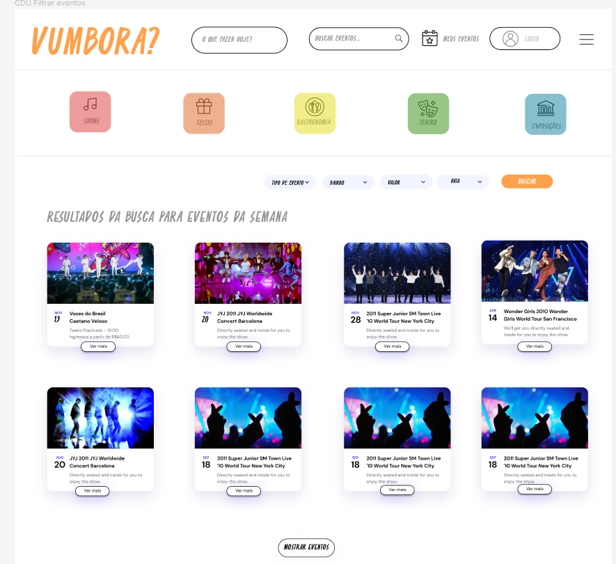

# CDU002. Filtrar Eventos

- **Ator principal**: Usuário, público geral, produtora
- **Atores secundários**: ...	 
- **Resumo**: *O sistema precisa ser capaz de filtrar os eventos a partir de opções pré-estabelecidas nos critérios de valor, tipo de evento(categoria), bairro e data. O sistema deve oferecer as seguintes opções pré determinadas dentro dos critérios, valor: Gratuito, até 10 reais, até 30 reais, até 50 reais e acima de 50. Data: Essa semana. Gênero: Shows, gastronomia, teatro, festas, exposições. Além disso, deve oferecer a possibilidade de pesquisar por texto eventos usando sua descrição, local e/ou nome.* 
- **Pré-condição**: Sem pré-condições
- **Pós-Condição**: Os eventos filtrados serão listados para o usuário.

## Fluxo Principal
| Ações do ator | Ações do sistema |
| :-----------------: | :-----------------: | 
| 1 - Usuário escolhe a opção de filtrar os eventos da semana, por gênero, valor ou data. | 2 -  Sistema abre página de resultados com o tipo de evento escolhido e oferece a possibilidade de filtrar também com os três outros critérios. | 
| 3 - Usuário escolhe adicionar ou não mais critérios na filtragem e confirma a opção caso decida adicionar. | 4 - Sistema retorna os resultados pertinentes. |

## Fluxo Alternativo I : Críterios de Filtragem não condizentes
| Ações do ator | Ações do sistema |
| :-----------------: |:-----------------: | 
| 3 - Usuário escolhe adicionar ou não mais critérios na filtragem e confirma a opção caso decida adicionar. |4.1 - Sistema informa que não existem eventos condizentes com os critérios escolhidos e oferece a opção de voltar para a página anterior. |  
| 5.1 - Usuário escolhe voltar para a página anterior e escolhe novos parâmetros.| 6.1 - Sistema retorna para o passo 4 do fluxo básico. |

## Fluxo Alternativo II : Filtragem por Palavras Chaves
| Ações do ator | Ações do sistema |
| :-----------------: | :-----------------: | 
| 1.2 - Ator escreve palavras chaves relacionadas com o que procura. |2.2 - Sistema procura coincidências das palavras digitadas com nome, local, descrição e gênero dos eventos cadastrados na plataforma e retorna uma lista dos eventos que apresentam coincidências, ordenando pelo número de coincidências que não devem considerar letras maiúsculas como diferente de minúsculas e nem os acentos. Sistema também oferece a possibilidade de filtrar a busca por gênero, valor ou data. Fluxo retorna para o fluxo principal no passo 3. |

## Protótipo 

