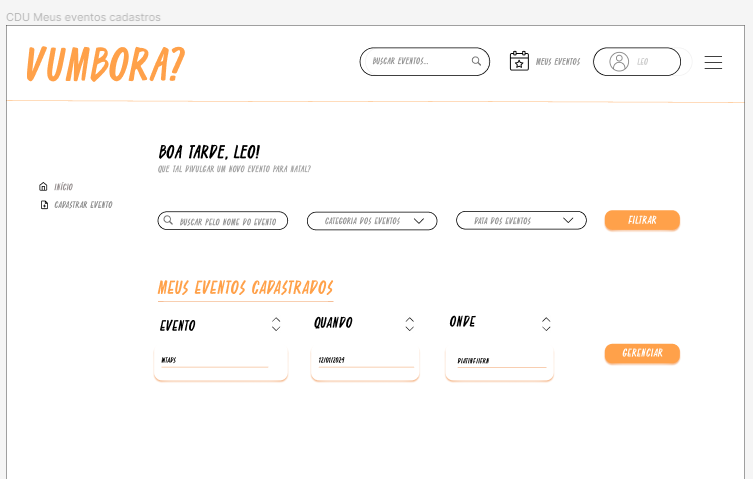

# CDU004. Meus Eventos Cadastrados 

- **Ator principal**: Usuário Cadastrado, Produtora
- **Atores secundários**: Usuário Comum	 
- **Resumo**: Irá ser mostrado para o usuário todos os eventos que o próprio usuário cadastrou.
- **Pré-condição**: Ter feito o cadastro no site
- **Pós-Condição**: Visualização de todos os eventos que o usuário cadastrou.

## Fluxo Principal
| Ações do ator | Ações do sistema |
| :-----------------: | :-----------------: | 
| 1 - O usuário seleciona a opção que irá dá acesso ao seus eventos cadastrados | 2 - O sistema recupera e exibe a lista de eventos que o usuário cadastrou com campos para *filtragem* desses eventos.|
| 3 - O usuário pode visualizar detalhes adicionais de cada evento e realizar modificações, se necessário.|

## Fluxo Alternativo I : Usuário não logado
| Ações do ator | Ações do sistema |
| :-----------------: | :-----------------: | 
| 1 - Usuário comum tenta acessar a opção que lista seus eventos cadastrados | 2 - Sistema Redireciona o Usuário Comum para a tela de login |
| 3 - O Usuário Comum loga no sistema | 4 - Sistema redireciona para a tela de seus eventos cadastrados |

## Fluxo de Exceção : Nenhum Evento não cadastrado
| Ações do ator | Ações do sistema |
| :-----------------: | :-----------------: | 
| 1 - Usuário sem nenhum evento cadastrado acessa a opção que lista seus eventos | 2 - Sistema redireciona para a tela de seus eventos cadastrados com a mensagem que diz que não existe nenhum evento cadastrado |

## Protótipo

