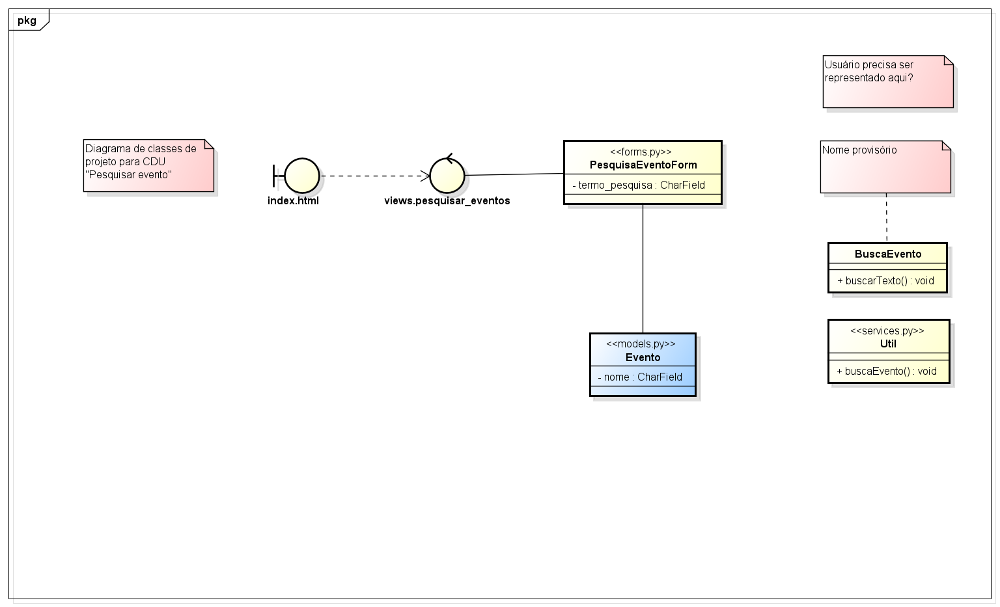
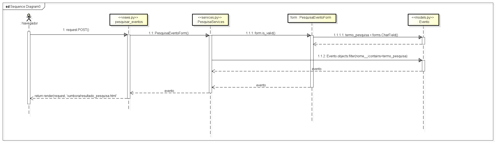

# CDU007. Pesquisar Eventos

- **Ator principal**: Usuário, público geral, produtora
- **Atores secundários**: ...	 
- **Resumo**: O sistema deve oferecer a possibilidade de pesquisar por texto eventos usando fragmentos de texto relacionados ao tipo de evento desejado pelo usuário.
- **Pré-condição**: Sem pré-condições
- **Pós-Condição**: Mostrar resultado da pesquisa do usuário.

## Fluxo Principal 
| Ações do ator | Ações do sistema |
| :-----------------: | :-----------------: | 
| 1. - Ator escreve palavras-chave ou fragmentos de texto relacionados com o evento que procura. |2. - Sistema procura coincidências das palavras digitadas com nome, local, descrição e gênero dos eventos cadastrados na plataforma e retorna uma lista dos eventos que apresentam coincidências, ordenando pelo número de coincidências que não devem considerar letras maiúsculas como diferente de minúsculas e nem os acentos. |
|3. - Ator recebe o resultado da busca.

## Fluxo de Exceção I - Erro na digitação da palavra-chave
| Ações do ator | Ações do sistema |
| :-----------------: |:-----------------: | 
| |2.1 - Sistema informa que não existem eventos condizentes com os critérios fornecidos manualmente e retorna para a página anterior. |  
| 2.2 - Usuário recebe mensagem de erro para fornecer novos parâmetros de texto condizentes com a pesquisa do evento que ele deseja buscar.| 2.3 - Sistema retorna para o passo 2 do fluxo principal. |

## Diagrama de Classes de Projeto

## Diagrama de Sequência

