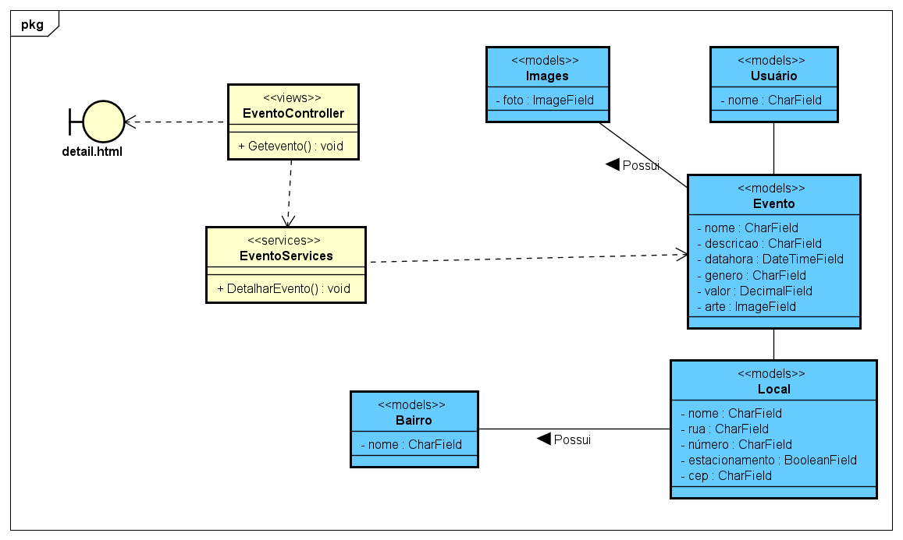

# CDU008. Detalhar Evento

- **Ator principal**: Público geral
- **Atores secundários**: ...	 
- **Resumo**: O sistema deve mostrar as informações pertinentes ao evento, sendo elas a arte do evento, suas fotos, o nome, a descrição, o gênero, valor de entrada, data, horário, local, comentários sobre o evento e as avaliações do evento caso ele já tenha ocorrido. 
- **Pré-condição**: Sem pré-condição
- **Pós-Condição**: Sem pós-condição

## Fluxo Principal
| Ações do ator | Ações do sistema |
| :-----------------: | :-----------------: | 
| 0 - Usuário escolhe o evento que deseja detalhar. | 1 - Sistema exibe todas as informações referentes ao evento: arte, foto(s), nome, descrição, gênero, valor de entrada, data, horário, local, comentários e avaliações caso o evento já tenha ocorrido. |

## Fluxo Alternativo - Sem imagens
| Ações do ator | Ações do sistema |
| :-----------------: | :-----------------: | 
| 0 - Usuário escolhe o evento que deseja detalhar. | 1 - Sistema tenta exibir todas as informações referentes ao evento: arte, foto(s), nome, descrição, gênero, valor de entrada, data, horário, local, comentários e avaliações caso o evento já tenha ocorrido. No entanto, o evento não tem arte, nesse caos deve ser exibido uma imagem padrão. O mesmo deve ocorrer para o caso do evento não possuir imagem relacionada. |

## Fluxo de exceção - Evento inexistente
| Ações do ator | Ações do sistema |
| :-----------------: | :-----------------: | 
| 0 - Usuário escolhe o evento que deseja detalhar. | 1 - Sistema reconhece que o evento em questão não existe e exibe apenas a mensagem que o que está sendo procurado não existe e um botão para retornar a página inicial. |

Observação: essa deve ser a imagem padrão a ser utilizado em todos os casos que o usuário não fornecer as imagens de sua escolha. 

 - Diagrama de Classes
 - Diagrama de Sequência