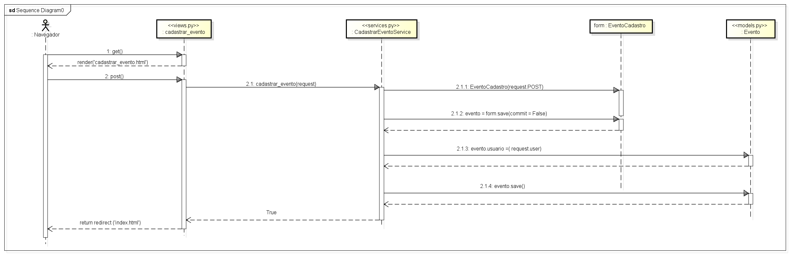

# CDU009. Gerenciar Evento

- **Ator principal**: Usuário Cadastrado, Produtora
- **Atores secundários**: ...	 
- **Resumo**: O sistema precisa ser capaz de fornecer a possibilidade de "manter evento", o que seria equivalente a criar, atualizar, listar e excluir eventos criados pelo usuário. É necessário que dentro desse cenário sejá possível atribuir valores, inserir tipos de evento(categoria), bairro, data, imagens do evento, bem como uma descrição com mais informações sobre ele. Além disso, deve oferecer a possibilidade de fornecer uma listagem que permita a visualização dos eventos pertencentes ao usuário que está logado. 

- **Pré-condição**: Estar logado no sistema.
- **Pós-Condição**: Os eventos mantidos serão listados para o usuário.

## Fluxo Principal - Cadastrar Evento
| Ações do ator | Ações do sistema |
| :-----------------: | :-----------------: | 
| 0 - Usuário clica no botão da interface para criar um evento. | 1 -  Sistema abre um formulário fornecendo para preenchimento de informativos sobre e evento. No formulário estão incluídos campos sobre o evento a ser criado como nome, data e a hora, valor, gênero do evento, arte correspondente ao perfil do evento, descrição, além de informações sobre o local (nome do local, cep, rua, número e se possui estacionamento) incluindo o bairro onde ocorrerá. | 
| 2 - Usuário preenche cada um dos campos e clica no botão "Salvar evento". | 3 - Sistema retorna mensagem de evento criado com sucesso. |

## Fluxo Alternativo I : Atualizar Evento Cadastrado
| Ações do ator | Ações do sistema |
| :-----------------: | :-----------------: | 
| 0 - Usuário acessa botão "Meus eventos" | 1 - Sistema redireciona o usuário para a tela de eventos cadastrados. |
| 3 - O Usuário clica no botão para editar evento | 4 - Sistema redireciona para a tela do formulário onde o usuário pode visualizar os campos contendo as informações já salvas do evento e escolher o que dentro deles será alterado. |
| 5 - O Usuário edita as informações do(s) campo(s) escolhidos para alteração e clica em salvar. | 4 - Sistema exibe mensagem de sucesso referente as alterações realizadas. |

## Fluxo Alternativo II : Listar Evento Cadastrado
| Ações do ator | Ações do sistema |
| :-----------------: | :-----------------: | 
|0 - Usuário acessa botão "Meus eventos" | 1 - Sistema redireciona o usuário para a listagem dos eventos cadastrados referentes ao usuário que está logado no sistema. |

## Fluxo Alternativo III : Excluir Evento Cadastrado
| Ações do ator | Ações do sistema |
| :-----------------: | :-----------------: | 
| 0 - Usuário acessa botão "Meus eventos" | 1 - Sistema redireciona o usuário para a tela de eventos cadastrados. |
| 2 - O Usuário clica no botão para excluir o evento desejado. | 3 - Sistema pede a confirmação do usuário pela solicitação de exclusão do evento cadastrado. |
| 4 - O Usuário clica no botão para concluir a exclusão do evento. | 3 - Sistema mensagem de sucessão relativa a exclusão do evento. |

## Diagrama de sequência

