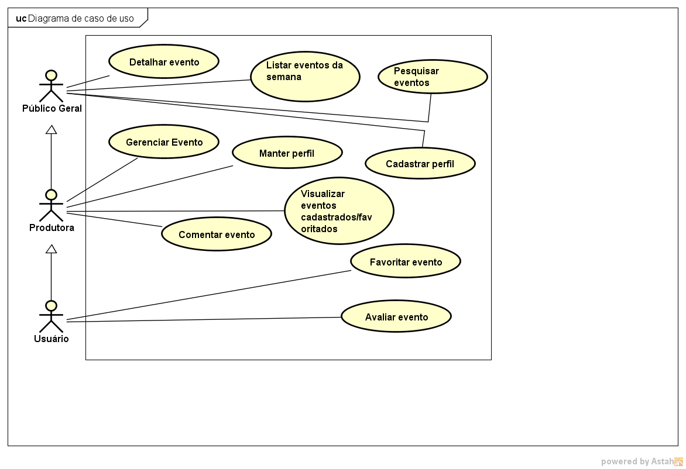

# Modelo de Casos de Uso

## 1. Diagrama de Casos de Uso

## 2. Listagem dos detalhamentos dos casos de uso

1. [CDU-001 - Listar Eventos](cdu-001-Listar-Evento(F03)/Listar-eventos.md)
2. [CDU-002 - Filtrar Eventos](cdu-002-Filtrar-Eventos(F08)/Filtrar-eventos.md)
3. [CDU-003 - Cadastrar Eventos](cdu-003-Cadastro-de-Evento(F01)/Cadastrar-Evento.md)
4. [CDU-004 - Meus Eventos Cadastrados](cdu-004-Meus-Eventos-Cadastrados(F04)/Meus-Eventos-Cadastrados.md)

6. [CDU-006 - Pesquisar Eventos](cdu-006-Pesquisar-Eventos)/Pesquisar-Eventos.md)
