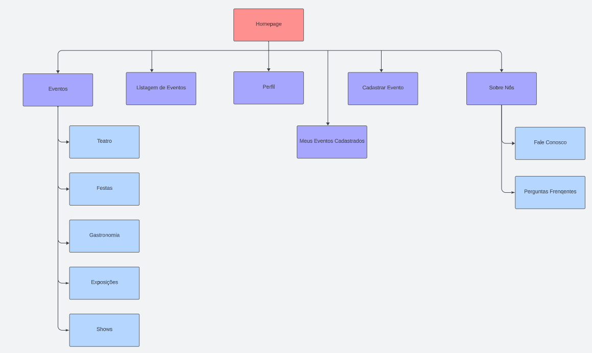

# Mapa do Site

| Data | Responsável | Descrição|
|------|-------------|----------|
|27/09/23| Leonardo  | Ajuste do mapa do site e descrição do mesmo|

# Imagem referente ao Mapa do Site:

## Descrição referente ao Mapa do Site:
Partindo da home, que será a página inicial do sistema, o usuário têm como alternativas; Visualizar todos os evntos disponíveis e já cadastrados no sistema. (página: **Listagem de Eventos(Vumbora?)**), pesquisas específicas por temas dos eventos (página: **Eventos**), **Criar Evento**, que de forma direta, será um “formulário” onde o usuário irá pôr todas as informações do evento e logo depois clicará na opção **Publicar Evento**. (página: **Cadastrar Eventos**) visualizar os eventos que o próprio usuário cadastrou(opção: **Meus Eventos Cadastrados**), saber mais sobre os criadores da plataforma (opção: **Sobre Nós**), estando nessa opção, o usuário terá acesso às opções: **Perguntas Frequentes**, que será para tirar dúvidas sobre funcionamentos do sistema, e a opção **Fale conosco**, que sería para que os possíveis usuários, caso tenham dúvidas específicas, contatem, nós, os criadores do sistema.
O usuário terá a opção de acessar seu perfil, mas como pré-requisito, terá que ter um login no sistema.o(opção: **Perfil**)
