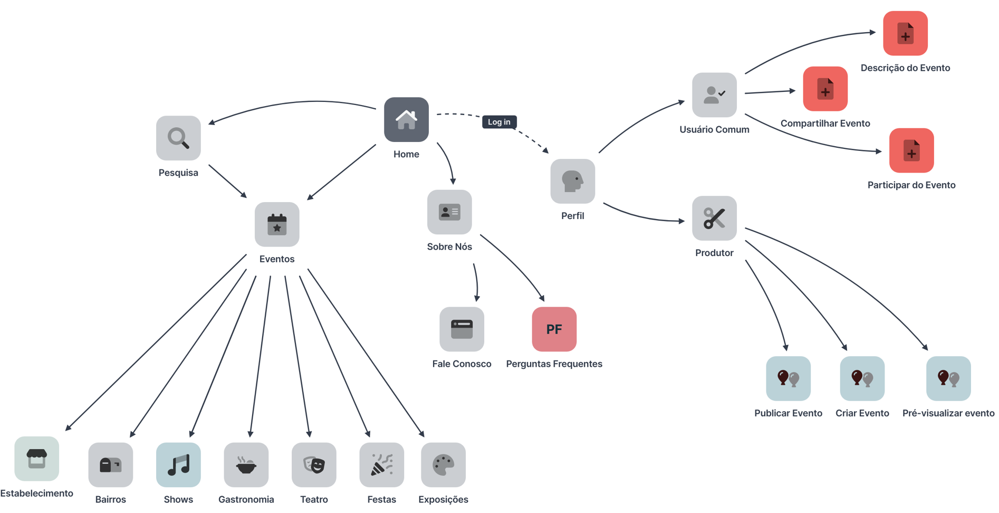

# Mapa do Site

| Data | Responsável | Descrição|
|------|-------------|----------|
|27/09/23| Leonardo  | Ajuste do mapa do site e descrição do mesmo|

# Imagem referente ao Mapa do Site:

## Descrição referente ao Mapa do Site:
Partindo da home, que será a página inicial do sistema, o usuário têm como alternativas; pesquisas específicas sobre os eventos (opção: **Pesquisa**), ir diretamente para a página dos eventos onde os mesmo irão estar ramificados e divididos por temas (opção: **Eventos**), saber mais sobre os criadores da plataforma (opção: **Sobre Nós**), estando nessa opção, o usuário terá acesso às opções: **Perguntas Frequentes**, que será para tirar dúvidas sobre funcionamentos do sistema, e a opção **Fale conosco**, que sería para que os possíveis usuários, caso tenham dúvidas específicas, contatem, nós, os criadores do sistema.
O usuário terá a opção de acessar seu perfil, mas como pré-requisito, terá que ter um login no sistema. Ao entrar na opção de **Perfil** do **Usuário Comum** o mesmo terá disponível as opções de; **Compartilhar Evento**, também poderá ver a descrição de cada evento (opção; **Descrição do Evento**) e a opção de **Participar do Evento**, onde a confirmação da participação será feita por uma linkagem para outro site que disponibilizará a compra do ingresso ou a confirmação da inscrição. Entrando na opção do **Perfil** do **Produtor**, o mesmo terá as seguintes opções; **Criar Evento**, que de forma direta, vai ser um “formulário” onde o produtor irá por todas as informações do evento. Também terá a opção de **Pré-visualizar Evento** onde o produtor poderá ver, antes da publicação, como ficará a visualização do evento, quando publicado. Por fim, o Produtor, após finalizar os detalhes do seu evento, fará a publicação do evento na plataforma com a opção **Publicar Evento**.
