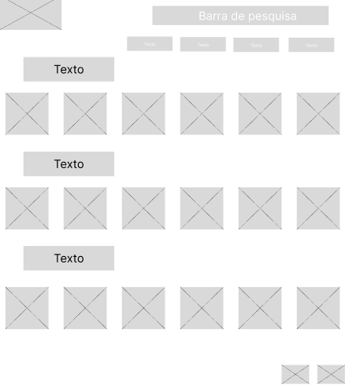
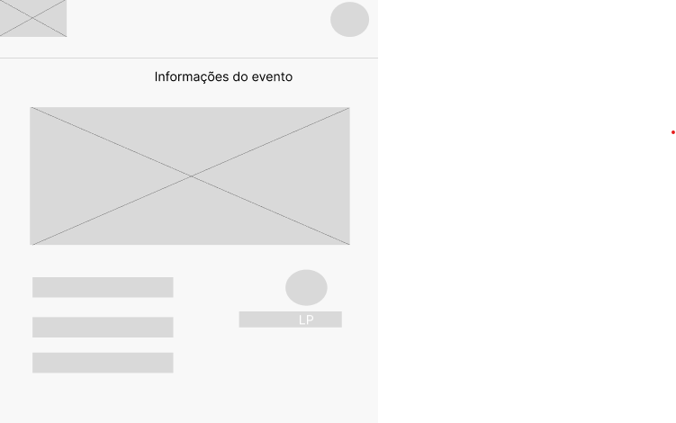
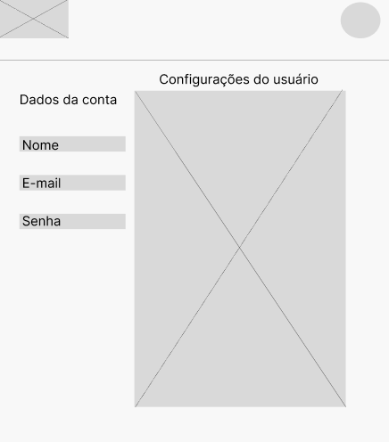
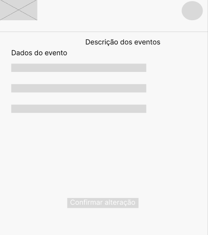
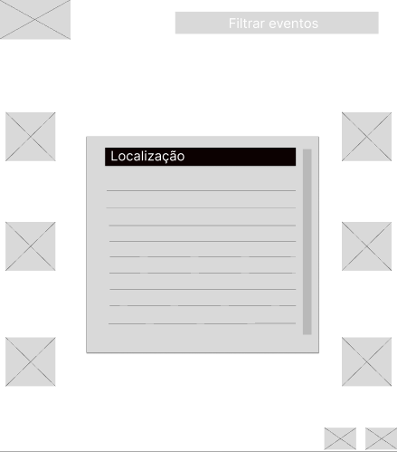
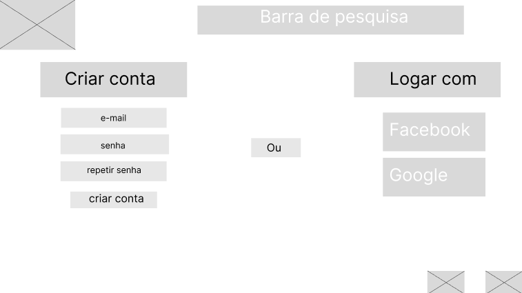
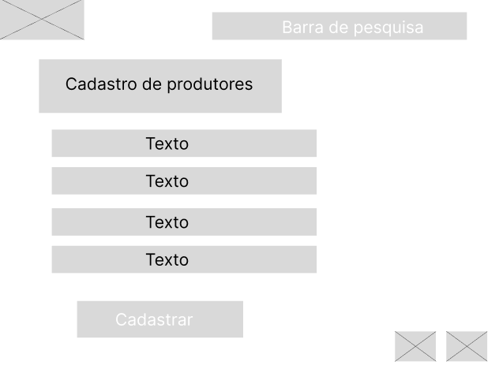

# Protótipos de Interface com o Usuário

### Descrição:
Foram realizadas nove telas de baixa fidelidades a partir das definições internas do documento de visão e o mapa do site.

## Página inicial

## Página do sobre nós

## Página Evento

## Página de Perfil

##Página de Eventos

##Página de filtragem de eventos

##Página Cadastro de Usuário

##Página Cadastro de Produtores

##Página Cadastro de Eventos

