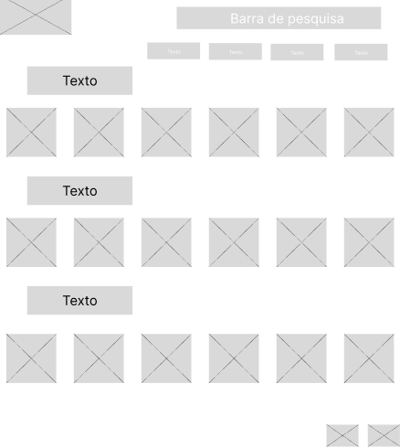
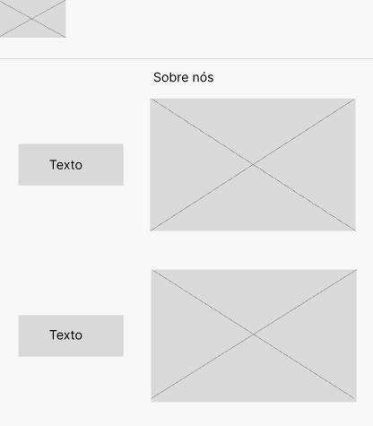
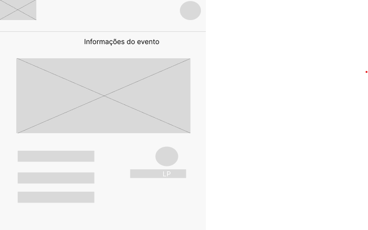
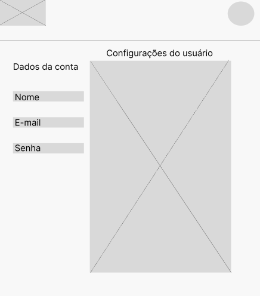
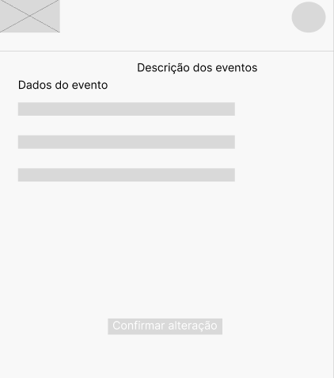
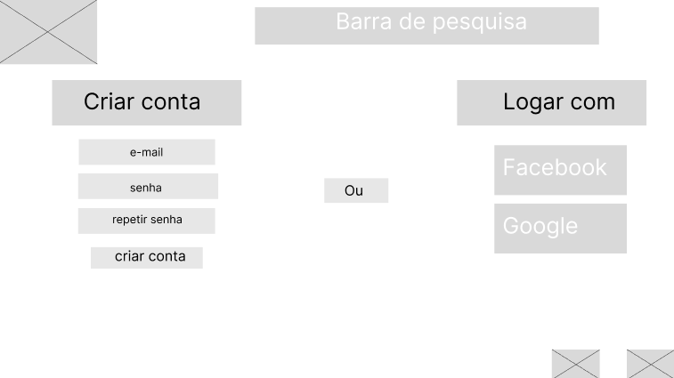
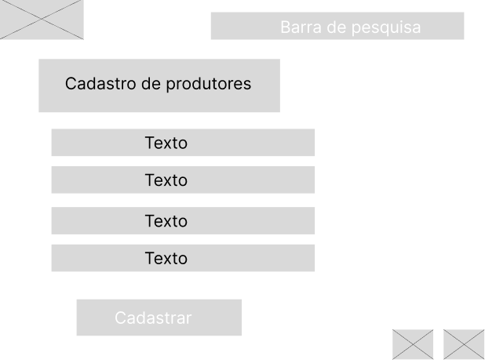
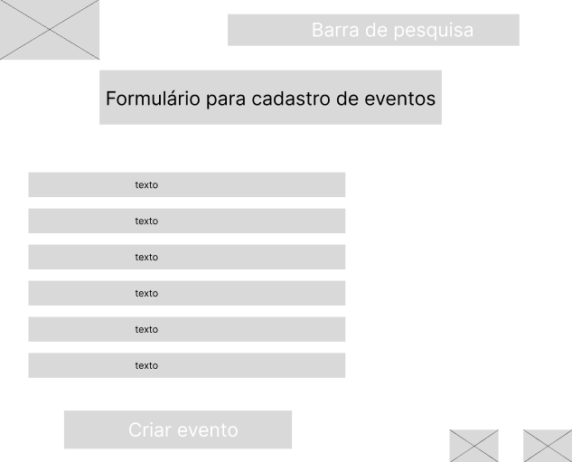

# Protótipos de Interface com o Usuário

### Histórico de Atualização
| Data | Responsável | Observação |
|------|-------------|------------|
| 27/09/23 | Maria Giovanna | Versão inicial |
| 28/09/23 | Fellipe Aleixo | Mudando o local das imagens dos protótipos |
| - | - | - | 

### Descrição:
Foram realizadas nove telas de baixa fidelidades a partir das definições internas do documento de visão e o mapa do site.

## Página inicial

## Página do sobre nós

## Página Evento

## Página de Perfil

## Página de Eventos

## Página de filtragem de eventos

## Página Cadastro de Usuário

## Página Cadastro de Produtores

## Página Cadastro de Eventos

